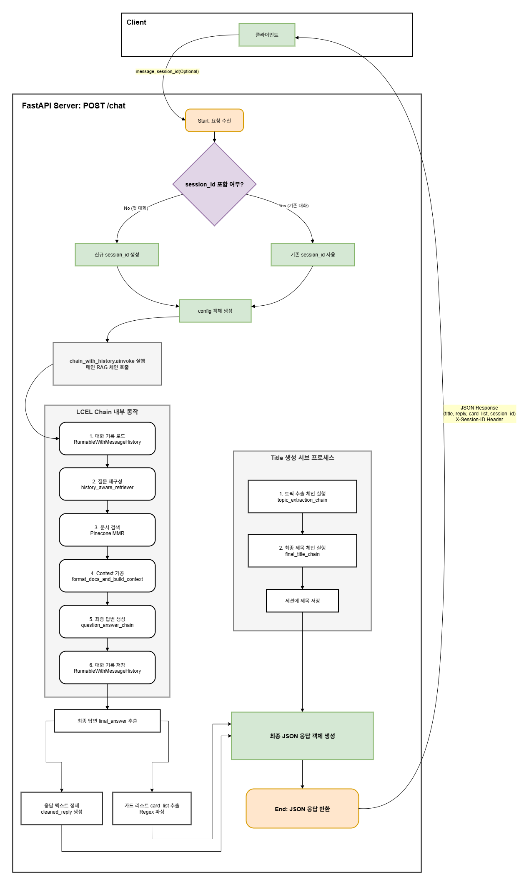

## Backend
### 1. 시스템 아키텍처
본 시스템은 크게 **데이터 전처리 및 임베딩 파이프라인(`embed.py`)**과 **실시간 추론 및 API 서빙 파이프라인(`app.py`)** 두 부분으로 구성됩니다.

- 데이터 소스: `all_cards.txt` 파일에 정의된 비정형 텍스트 형태의 카드 정보

- 전처리/임베딩 (`embed.py`): 텍스트 파일을 읽어와 LangChain의 `Document` 객체로 변환하고, Upstage의 `solar-embedding-1-large` 모델을 사용하여 텍스트를 4096차원의 벡터로 변환합니다.

- Vector DB (`Pinecone`): 임베딩된 벡터와 메타데이터(카드 이름, 카드사, 원본 텍스트 등)를 저장하고, 의미 기반의 빠른 유사도 검색을 지원합니다.

- API 서버 (`app.py`): FastAPI를 기반으로 구축되었으며, `/chat` 엔드포인트를 통해 사용자의 요청을 받아 RAG 체인을 실행하고, 구조화된 JSON 응답을 반환합니다.

- LLM & Framework: Upstage의 Solar LLM을 LangChain 프레임워크와 결합하여 전체 RAG 및 대화 관리 로직을 구현합니다.

### 2. 핵심 로직 상세 설명
**2.1. 데이터 임베딩 파이프라인 (`embed.py`)**
이 스크립트는 비정형 텍스트 데이터를 RAG 시스템이 활용할 수 있는 벡터 데이터로 변환하여 Pinecone에 저장하는 역할을 합니다.

1. 데이터 로드 및 분할:

    - `all_cards.txt` 파일을 읽어 `[카드 이름]` 패턴을 기준으로 각 카드별 정보(`card_blocks`)를 분리합니다.

    - `create_card_documents` 함수를 통해 각 카드 블록을 더 작은 의미 단위(Option 기준 또는 문단)로 나누어 LangChain의 `Document` 객체를 생성합니다.

2. 메타데이터 생성:

    - 각 `Document` 조각에는 검색 및 답변 생성 시 활용할 수 있도록 다음과 같은 메타데이터가 포함됩니다.

        - `card_name`: 카드 이름

        - `card_corp`: 카드사

        - `card_full_data`: 해당 조각이 포함된 원본 카드 전체 텍스트

3. 임베딩 및 업로드:

    - Upstage의 `solar-embedding-1-large` 모델을 사용하여 모든 `Document`의 `page_content`를 4096차원 벡터로 변환합니다.

    - Pinecone API의 부하를 줄이고 안정적인 업로드를 위해, `PineconeVectorStore.add_documents`를 사용하여 **배치(batch) 방식**으로 데이터를 순차적으로 업로드합니다. (기본 배치 크기: 20)

**2.2. 실시간 추론 API (`app.py`)**
이 스크립트는 사용자의 요청을 받아 대화형 RAG 체인을 실행하고, 최종 결과를 반환하는 FastAPI 서버입니다.



**전역 객체 및 체인 구성**
- 서버 시작 시, LLM, Retriever, RAG 체인 등 무거운 객체들을 **전역적으로 한 번만 초기화**하여 매 요청마다 발생하는 지연을 최소화합니다.

- LLM 인스턴스 분리:

    - `llm_rag`: 메인 RAG 답변 생성을 위한 LLM

    - `llm_title`: 대화 제목 요약만을 위한 LLM

    - 역할을 분리하여 각 LLM이 다른 작업의 문맥에 영향을 받는 것을 방지하고, 역할 혼동 오류를 최소화합니다.

**대화형 RAG 체인 (LCEL 기반)**
`RunnableWithMessageHistory`를 중심으로 구성된 이 체인은 다음과 같은 정교한 단계를 거쳐 답변을 생성합니다.

1. `get_session_data` & `chat_sessions`:

    - 사용자별 대화 기록과 제목을 서버 메모리의 `chat_sessions` 딕셔너리에 저장하고 관리합니다. `session_id`를 키로 사용하여 각 대화 세션을 구분합니다.

2. `create_history_aware_retriever` **(질문 재구성)**:

    - 사용자의 현재 질문(`input`)과 이전 대화 기록(`chat_history`)을 받아, 검색에 용이한 독립적인 질문으로 재구성합니다. (예: "그건 어때?" → "신한카드 Deep Dream Platinum+는 어때?")

3. `format_docs_and_build_context` **(Context 가공)**:

    - `history_aware_retriever`가 Pinecone에서 검색한 `Document` 리스트를 입력받습니다.

    - 카드 이름 기준으로 중복을 제거하고, 각 카드의 전체 정보(`card_full_data`)를 하나의 큰 `context` 문자열로 조합합니다. 이 맞춤형 로직을 통해 LLM에게 더 풍부하고 정제된 정보를 제공합니다.

4. `create_retrieval_chain` **(최종 답변 생성)**:

    - 재구성된 질문, 가공된 `context`, 그리고 전체 대화 기록을 `qa_prompt`에 주입하여 `llm_rag`를 통해 최종 답변을 생성합니다.

**동적 제목 생성 로직**
- `is_new_conversation`: 요청에 `session_id`가 없는 경우를 '새로운 대화'로 판단합니다.

- 단계별 요약:

    1. `topic_extraction_chain`: 새로운 대화일 경우, 사용자의 첫 질문에서 핵심 토픽(명사구)을 먼저 추출합니다.

    2. `final_title_chain`: 추출된 토픽을 기반으로 최종적인 대화방 제목을 생성합니다.

- 이 2단계 접근법은 LLM이 AI의 긴 답변 형식을 모방하는 대신, 사용자의 질문 의도에만 집중하여 간결한 제목을 생성하도록 유도합니다.

**구조화된 응답 반환**
- `chat_endpoint`는 최종적으로 생성된 `final_answer`에서 `- Cardly Recommending: [...]` 패턴을 정규표현식으로 파싱하여 `card_list`를 추출하고, 사용자에게 보여줄 답변에서는 해당 라인을 제거합니다.

- `reply`, `session_id`, `title`, `card_list`를 포함한 최종 JSON 객체를 반환합니다.

### 3. 실행 및 테스트
**3.1. 환경 설정**
```bash
# 1. 가상 환경 생성 및 활성화
python -m venv venv
.\venv\Scripts\activate

# 2. 의존성 패키지 설치
pip install -r requirements.txt

# 3. .env 파일 생성 및 API 키 입력
# UPSTAGE_API_KEY="up_..."
# PINECONE_API_KEY="..."
```

**3.2. 데이터 임베딩**
API 서버를 실행하기 전, 반드시 아래 명령어를 실행하여 `all_cards.txt`의 데이터를 Pinecone에 저장해야 합니다.
```bash
python embed.py
```

**3.3. API 서버 실행**
```bash
python app.py
```

서버가 성공적으로 실행되면 `http://localhost:8000`에서 API 요청을 보낼 수 있습니다.